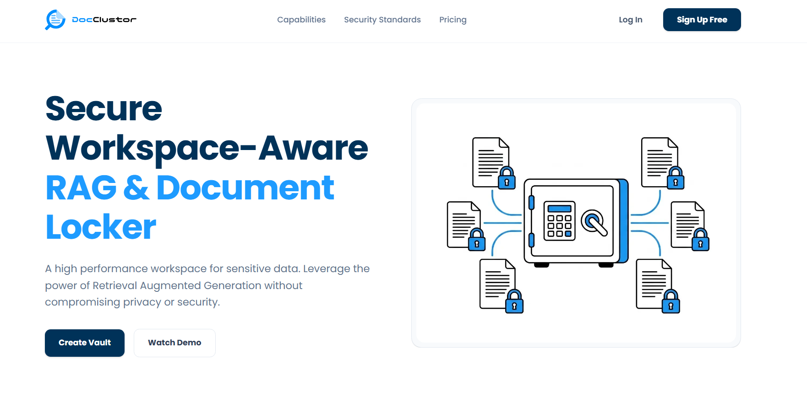
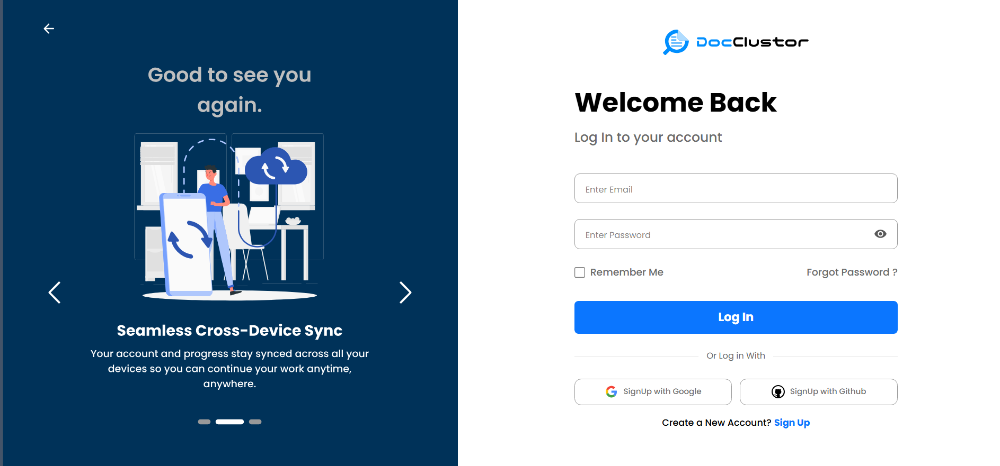
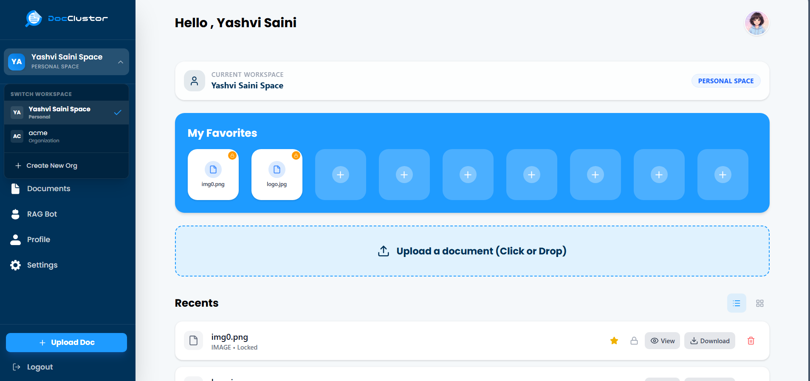
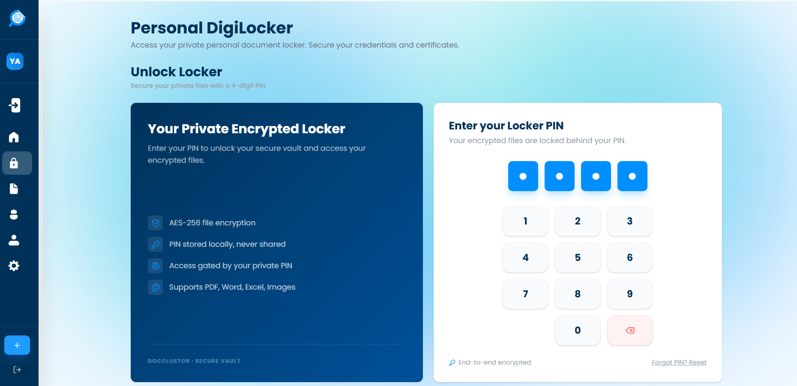
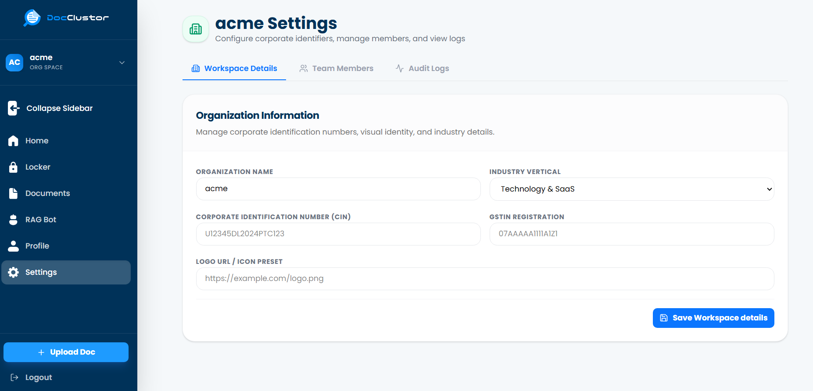
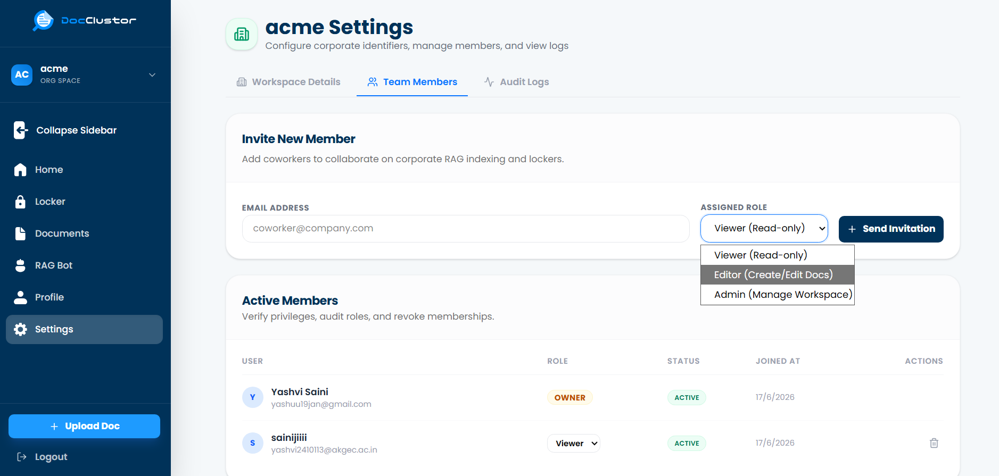
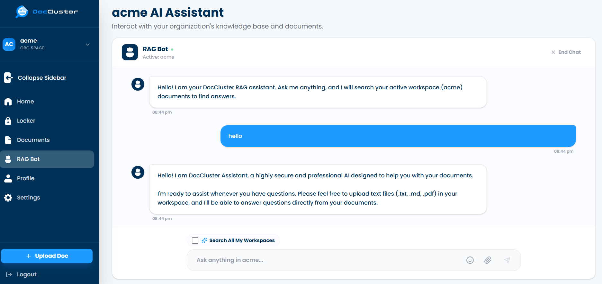

# DocClustor: Secure Workspace-Aware RAG & Document Locker

DocClustor is a secure, multi-tenant document management and retrieval-augmented generation (RAG) platform. Designed for both individual users and organizations, DocClustor provides a hardened, zero-knowledge vault (Personal Locker) alongside workspace-isolated AI querying.

---

## Key Features

### 1. Workspace-Aware Architecture
* **Personal Space:** A private sandbox for personal documents, lockers, and chat sessions.
* **Organization Space:** Shared workspaces supporting user roles (`OWNER`, `ADMIN`, `EDITOR`, `VIEWER`) to facilitate secure collaboration.
* **Multi-Tenant Isolation:** The backend explicitly cross-references the user's JWT credentials against database memberships for every request, ensuring zero cross-tenant data leaks.

### 2. Zero-Knowledge Document Locker
* **PIN Key Derivation:** Locker access is protected using **PBKDF2-SHA512** with 600,000 iterations, combining the user's PIN, a per-locker salt, and a server-side pepper (`CRYPTO_PEPPER`).
* **Brute-Force Rate Limiting:** Built-in security locks the locker for 15 minutes after 5 consecutive failed PIN entries.
* **AES-256-GCM Encryption:** Secure files are encrypted on the fly. Keys are never saved to the database.

### 3. Granular Document Visibilities (Org Space)
* **SHARED:** Readable by all members of the organization.
* **ADMIN_ONLY:** Restricted to organization Owners and Admins.
* **PRIVATE:** Locked strictly to the uploader. Not even organization Owners can view or access private files uploaded by other members.

### 4. Workspace-Isolated RAG Bot
* AI queries only fetch context from documents the user is actively authorized to view within their current workspace context, preserving privacy.

---

##  Tech Stack
* **Framework:** Next.js (App Router, React client-side hooks)
* **Database & ORM:** PostgreSQL + Prisma ORM (equipped for vector searching)
* **Authentication:** JWT tokens via `jose`, Session cookies with instant revocation (`tokenVersion`)
* **Security:** PBKDF2 key derivation, AES-256-GCM symmetric encryption

